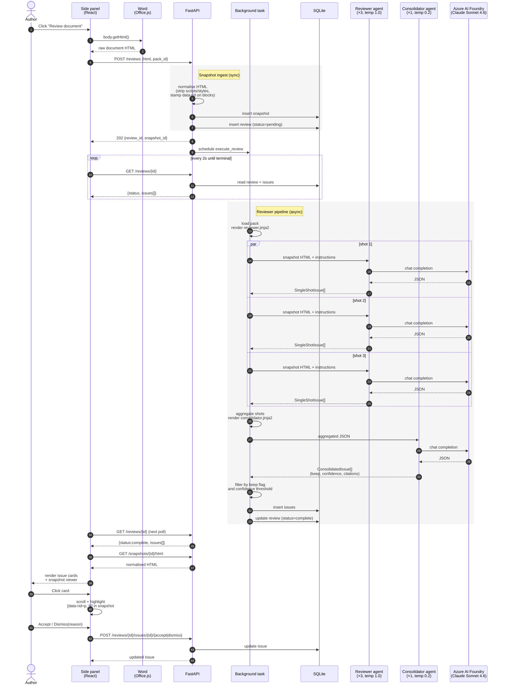

# CoReview — Word Drafting Assistant (Tracer Bullet)

A Word add-in that helps authors draft and develop content by reviewing it
against style guides, policy, compliance, and organisational standards.

This is a **tracer bullet**: the thinnest end-to-end slice that validates the
approach before deeper investment.

## What this proves

1. An Office.js add-in can reliably extract a whole document as HTML.
2. Snapshot-based anchoring (interactive highlighting on a rendered HTML
   snapshot) works cleanly — no bounding boxes required.
3. A rules-in-context reviewer against whole-doc content produces useful,
   non-noisy findings.
4. The three-prompt pattern (guidelines → agent → consolidator) ports
   cleanly off PromptFlow to a plain async Python service.
5. The async job + polling UX feels acceptable in a side panel.

## Layout

```
backend/   FastAPI + Agent Framework + SQLite. Dockerised.
addin/     Word taskpane add-in: TypeScript, React 18, Fluent UI v9.
```

See `backend/README.md` and `addin/README.md` for per-package instructions.

## How a review flows

What happens when an author clicks **Review document** in the side panel.
Top-to-bottom is time; arrows are data or HTTP calls.



Key properties worth calling out:

- **One HTML capture, one canonical version.** The raw HTML from Word is
  normalised once at ingest and stored immutably; every subsequent highlight
  and every agent call targets that same snapshot.
- **Multi-shot diversity, single consolidation.** Three reviewer shots run
  concurrently at temperature 1.0 (`asyncio.gather`). A single consolidator
  pass at temperature 0.2 dedupes, scores confidence, and decides keep/drop.
- **No streaming.** Issues become visible to the taskpane only when the
  consolidator returns and the batch lands in SQLite. Status + issues-so-far
  are exposed via polling.
- **Guidance, not rewrites.** Every issue carries `explanation` + `guidance`
  (prose advice). The schema has no `suggested_fix` field. Authors decide.

## Core principles

- **Human in the loop.** The tool never rewrites content. It surfaces issues,
  explanations, and guidance. The author decides.
- **Snapshot-as-substrate.** Every review targets an immutable snapshot of
  the document at review time. Highlights render against the snapshot.
- **Whole-doc context.** The entire document goes into the LLM call in a
  single pass.
- **Review packs are first-class.** A pack is a named, governed unit of
  rules.
- **Rules in context, not RAG.** All rules go directly into the prompt.
- **Async with polling.** `POST /reviews` schedules a background task; the
  client polls `GET /reviews/{id}` every 2s.
